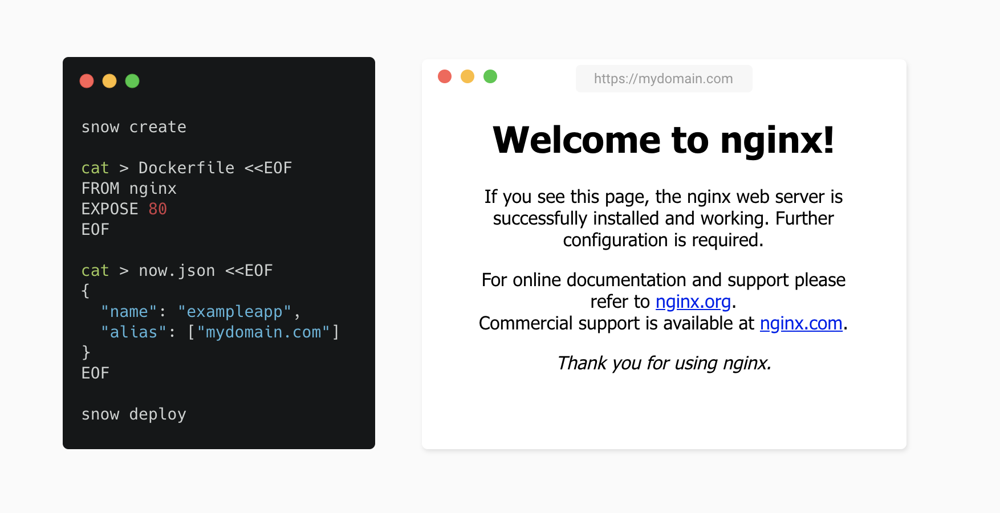

<div align="center">
  
  
</div>

> :snowflake: **S**elf-hosted **now** deployments

Enjoy effortless deployments with a clone of [now] on a cloud of your choosing.

### Features

- ⚡️ Deploy docker images via `snow` (or `snow deploy`)
- 🔒 Auto-configured SSL
- 🔃 Auto-scaling

### This is Magic 🔮

No, it isn't. This CLI abstracts away the complexities of using [Kubernetes], [cert-manager], [Kaniko], and a private [Docker Registry] together, replicating the functionality provided by `now`.

### Getting started

```sh
> npm i -g @snowjs/cli

# Install CLI tools
> snow install

# Create your kubernetes cluster (GCP)
> snow create

# Get your deployment's IP address
# And create a DNS 'A' record (e.g., myapp.com A 1.2.3.4)
> snow ip

# Deploy
> snow
```

### Supported commands

**Detailed** descriptions of supported commands at [docs/commands.md](docs/commands.md).

| Support            | Command                              | Description                   |
| ------------------ | ------------------------------------ | ----------------------------- |
| :white_check_mark: | \<none\>                             | Deploy                        |
| :white_check_mark: | `alias [ls]`                         | List aliases                  |
| :white_check_mark: | `alias set <deployment> <alias>`     | Create alias                  |
| :white_check_mark: | `alias rm <alias>`                   | Remove alias                  |
| :white_check_mark: | `certs [ls]`                         | List SSL Certificates         |
| :white_check_mark: | `certs issue <cn> [<cn>]`            | Issue certificate             |
| :white_check_mark: | `certs rm <cn>`                      | Remove a certificate          |
| :new:              | `create`                             | Create Kubernetes cluster     |
| :white_check_mark: | `deploy`                             | Deploy                        |
| :white_check_mark: | `domains [ls]`                       | List domains                  |
| :white_check_mark: | `domains add <domain>`               | Add domain                    |
| :no_entry:         | `domains buy <domain>`               | Buy domain                    |
| :white_check_mark: | `domains rm <domain>`                | Remove domain                 |
| :white_check_mark: | `login`                              | Login                         |
| :white_check_mark: | `logout`                             | Logout                        |
| :white_check_mark: | `ls`                                 | List deployments              |
| :new:              | `install`                            | Install CLI tools (via brew)  |
| :new:              | `ip`                                 | Get IP Address of deployments |
| :white_check_mark: | `rm <name>`                          | Remove deployment             |
| :white_check_mark: | `scale <deployment> <min> [<max>]`   | Scale deployment              |
| :white_check_mark: | `secrets [ls]`                       | List secrets                  |
| :white_check_mark: | `secrets add <key> <value>`          | Create secret                 |
| :white_check_mark: | `secrets rename <old-key> <new-key>` | Rename secret                 |
| :white_check_mark: | `secrets rm <key>`                   | Remove secret                 |

### Tell me more

The essential CLI commands to understand are `snow create` and `snow deploy`.

### Dependencies

The following CLI tools (installable via `snow install`) are necessary to orchestrate the entire end-to-end process, from Kubernetes cluster creation to managing your deployments:

- `kubectl` (for managing deployments, secrets)
- `helm` (for installing [tiller], [cert-manager], and [ingress-nginx] on your cluster)
- CLI tool for your cloud provider (e.g., `gcloud`).

If running Kubernetes locally on Minikube, you will additionally need these cli tools:

- `docker` (for running local registry)
- `minikube` (for running Kubernetes locally)
- `virtualbox` (for creating docker images)

[cert-manager]: https://github.com/jetstack/cert-manager
[docker registry]: https://github.com/helm/charts/tree/master/stable/docker-registry
[now]: https://github.com/zeit/now-cli
[ingress-nginx]: https://github.com/kubernetes/ingress-nginx
[kaniko]: https://github.com/GoogleContainerTools/kaniko
[kubernetes]: https://kubernetes.io/
